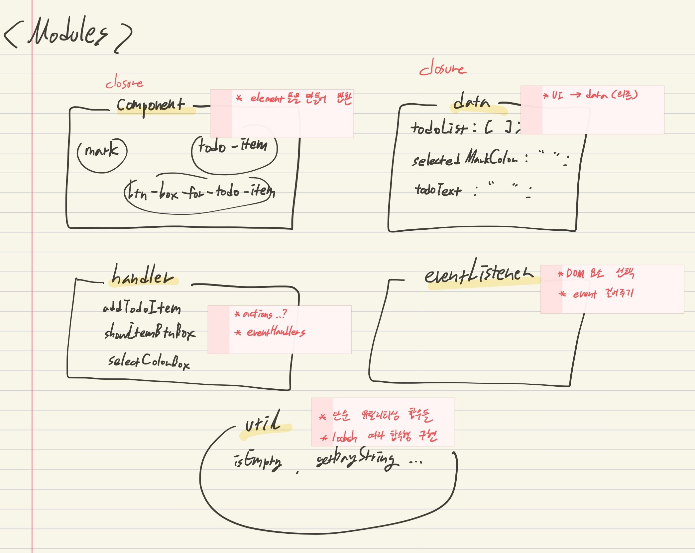
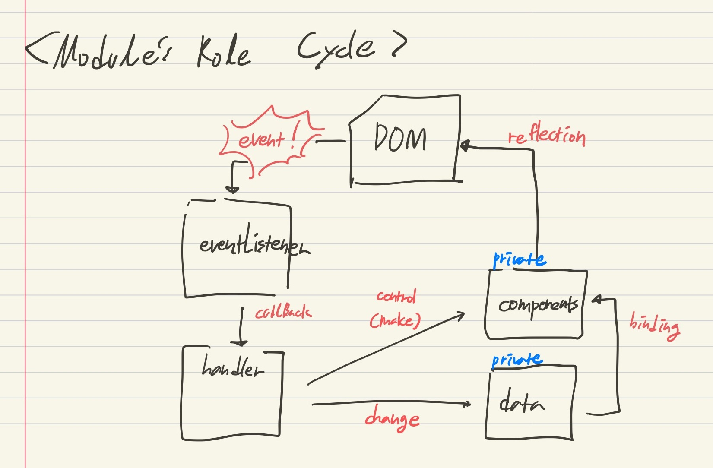

bbrㅠ

# **📒Todolist-app**

> HTML, CSS, Javascript 로 이것 저것 다 해보는 곳 🧪
> Back to the basic!

**[netlify로 연결해봤다](https://todolist-vanilla.netlify.app/)**(돈나가는 건 아니겠지? 믿는다 미국~!)

### **욕심 나열**

- [ ] todolist 단순 로직
- [ ] localStorage을 DB삼아 API 요청 유사하게 만들어 보기
- [ ] event loop 이해
- [ ] webpack, babel-loader
- [ ] SCSS
- [ ] validation check
- [ ] drag & drop
- [ ] vue
- [ ] server 구현
- [ ] 반응형, grid system
- [ ] progress bar
- [ ] functional 강의 들은 거 적용해서 util성 library 비스무리한거 만들어보기
- [ ] sign in, sign up
- [ ] theme (라섹남 나를 위한 dark 모드)
- [ ] react
- [ ] typescript
- [ ] AWS
- [x] npm 적용

---

 
 

## **00.todolist_vanilla**

> `DOM API`

- 누군가 사용했던 html, css을 빌려서 단순히 totolist app 로직을 위한 javascript 연습(출처를 찾아내자...)
- DOM api 를 연습에 집중

 

## **01.todolist_vanilla_publishing**

> `HTML`,` CSS`, `DOM API`

- 0년차 개발자, 업무 진행 중 생각보다 많은 시간이 소요되는 곳은 css와 HTML이었다.

  (왜 padding 살짝만 바꿔도 전체 구조가 깨지는 걸까?)

- 사내에서는 심지어 CSS pre-procesor, SCSS를 사용하지만, 제대로 알고 사용하는 것이 아닌, 원하는 속성을 가진 class명을 가져다 쓰는 수준이었다.

- HTML과 css 에 대한 이해가 너무나도 없는 것 같아서, 직접 디자인하고, 구조를 짜며, 퍼블리싱 연습을 해야겠다고 생각했다.

- 요즘 핫한 **Figma**를 사용해 디자인을 진행 보았다. **([Figma 결과물](https://www.figma.com/embed?embed_host=notion&url=https%3A%2F%2Fwww.figma.com%2Ffile%2F31hfwsgOtsvI8pyS9ZfTVQ%2Ftodolist-vanilla%3Fnode-id%3D1%253A95))**

  (기존에 adobe inllustrator와 photoshop을 다룰 줄 알았기 때문에, 생각보다는 재밌었다. 그치만, HTML, CSS 출력은 왜 안되는 걸까... 궁금한데... 내 직업을 사라지게 할 것만 같은 기술.. 직접 보고파!)

 

## **>> 02.todolist_vanilla_npm_parcel**

> `npm`, `netlify`, `parcel-bundler`

- webpack, npm, package, build, barbel, compile, css pre-processor 등... FE 생태계를 사용만 하지, 직접 세팅하고 공부할 생각을 못했다.
- 이제 더는 ... vsCode live-server로 서버를 올리지 않아!
- 구경꾼들을 위해 ... 보는 사람도 없겠지만, 사실 지하철에서 괜히 폰으로 켜서 자기만족을 하기 위해 **netlify**로 배포해보았다. 나만 보겠지... 오히려 안심.
- npm 은 알았는데, nvm은 몰랐다. java의 경우, 로컬 버전은 jenv 로 따로 관리했지만, node.js는 더 편리한 것 같다.
- parcel-bundler를 사용해 dev server를 열었다.
  그 package.json에 있는 script에 run dev를 직접 써보니까 괜히 개발자가 된 것 같아서 좋았다.
- git에 대해 많은 공부가 되는 것 같다. `.gitignore` 설정(node_modules, dist 나가!)
- HTML5 의 **`data-` attribute**에 대해 알게되었다.

  CSS class 로만 element들에게 의미를 부여했던 과거와 달리, 이걸 알아버린 나는 좀 더 편하게 element들을 다룰 수 있겠다고 생각에 가슴이 설레었다.

- CSS에 `:root{}` 등으로 **변수 처리**를 할 수 있다는 사실에 충격. 삶의 질이 높아졌다.

- javascript의 코드를 역할에 따라 분리해야겠다는 생각을 드디어 실천으로 옮겨보았다.  
   
  

  1. **components**

     - element들을 찍어내는 역할.
     - DOM API, Fragment와 ES6 문자열 리터럴를 사용해 element를 만든다.
     - 데이터는 전적으로 datas에 의존한다.(단방향)
     - 왠지 노출시키면 안될 것 같은 느낌이 들어서, 클로저로 필요한 부분만 노출

  2. **datas**

     - UI에 필요한, 그리고 추후 서버에도 보낼 때 필요한 데이터를 담당하는 곳
     - handler에 의해서만 변한다. (같은 data에 의해서도 변한다.)
     - zerocho said, 데이터가 변하면, 화면이 변한다.
     - 왠지 노출시키면 안될 것 같은 느낌이 들어서, 클로저로 필요한 부분만 노출

  3. **handlers**

     - 우리가 아는 그 핸들러
     - 따로 모아 관리하는 것이 편한 것 같아서 분리

  4. **eventListener**

     - 우리가 아는 그 리스너
     - 전역 말고 어디 멋진 곳에 모셔둘 수 없을까!
     - 고민 중

  5. **util**

     - 중역은 아니지만, 모이면 힘이되는 유틸리티성 함수 친구들!
     - 추후 유인동 선생님께 배운 함수형 프로그래밍을 적용해볼 수 있겠다. 마치 lodash 워!

- 각 module들의 역할과 돌아가는 꼴
  

- 수정 버튼 클릭 시, textContent를 input.value로 가져가야 했는데, `Node.replaceChild(newChild, oldChild)` 을 몰라서, element를 교체하는데 애를 먹었다.

- [2021.05.15] 'done' 기능 제외하고, 기본 기능 완성. (사실 done이 제일 메인 기능이긴 하지만...)
- CDN 으로 쓰던 lib, package로 전환(css reset, meterial-icon)
- 너무 아쉽지만 여기서 todolist-vanilla 잠시 중단. typescript 공부 시작
- git commit message 여러줄 입력 테스트...
  - option + enter 가 동작한다... 지금까지 해온 더러운 commit message.. 잊자
